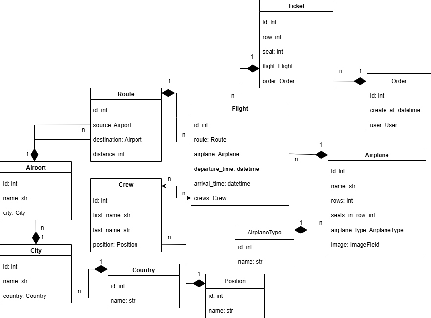

# Flight Booking API

A Django REST Framework project for managing flights, airports, airplanes, crews, and ticket reservations. Admins can manage flights, airplanes, routes, and crews, while users can browse flights and book tickets. Fully containerized with Docker and secured with JWT authentication.  

## 🌟 Features
- **Custom User Model** – Email-based authentication.  
- **JWT Authentication** – Secure access control using `djangorestframework-simplejwt`.  
- **Role-Based Permissions** – `IsAdminOrIfAuthenticatedReadOnly`.  
- **Core Models**:  
  - Countries, Cities, Airports  
  - Routes  
  - Airplanes & Airplane Types  
  - Flights & Crews  
  - Tickets & Orders  
- **Database Configuration** – Supports both local SQLite and PostgresSQL via Docker.  
- **API Documentation** – Swagger UI & Redoc via `drf-spectacular`.  
- **API Throttling**:  
  - Anonymous: 100 requests/day  
  - Authenticated: 1000 requests/day  
- **Docker Ready** – Easy deployment with Docker Compose.  

## 🛠️ Tech Stack
- Python 3.11+  
- Django 5.2+ & Django REST Framework  
- PostgresSQL (via Docker) / SQLite for local development  
- JWT Authentication  
- drf-spectacular for OpenAPI docs  
- Docker & Docker Compose  

## 🚀 Getting Started

### Prerequisites
- Python 3.11+  
- pip  
- Docker & Docker Compose (optional)  
- PostgresSQL (for Docker setup only, local SQLite works without it)  

### Clone the repository
  ```bash
    git clone https://github.com/Y-Havrilyv/flight-booking-api.git
    cd flight-booking-api
  ```
### Setup virtual environment & install dependencies
  ```bash
    python -m venv .venv
    source .venv/bin/activate  # Windows: .venv\Scripts\activate
    pip install -r requirements.txt
  ```
### Configure `.env`

Create a file named `.env` in the project root. Depending on whether you run the project locally or with Docker, use one of the following configurations:

**Local development (SQLite or local PostgresSQL):**
```env
DOCKER=False
POSTGRES_DB=flight
POSTGRES_USER=postgres
POSTGRES_PASSWORD=postgres
POSTGRES_HOST_LOCAL=localhost
POSTGRES_PORT=5432
PGDATA=/var/lib/postgresql/data
SECRET_KEY=your_secret_key_here
```
**Docker (PostgresSQL container):**
```env
DOCKER=True
POSTGRES_DB=flight
POSTGRES_USER=postgres
POSTGRES_PASSWORD=postgres
POSTGRES_HOST_DOCKER=db
POSTGRES_PORT=5432
PGDATA=/var/lib/postgresql/data
SECRET_KEY=your_secret_key_here
```
### Local Setup
  ```bash
    python manage.py migrate
    python manage.py runserver
  ```
The API will be available at http://127.0.0.1:8000
### Docker Setup
  ```bash
    docker-compose build
    docker-compose up -d
  ```
### Stop containers:
  ```bash
    docker-compose down
  ```
### Authentication

#### Endpoints

| Endpoint                  | Method | Description                   |
|----------------------------|--------|-------------------------------|
| `/api/user/register/`      | POST   | Register a new user           |
| `/api/user/token/`         | POST   | Obtain JWT token pair         |
| `/api/user/token/refresh/` | POST   | Refresh access token          |
| `/api/user/me/`            | GET    | Get current user profile      |

### Demo Users

| Environment | Email             | Password    |
|------------|------------------|------------|
| Docker     | admin@docker.com  | Admin1234! |
| Docker     | user@docker.com   | User1234!  |
| Local      | admin@local.com   | Admin1234! |
| Local      | user@local.com    | User1234!  |

### Usage
Include JWT token in headers:
  ```http
  Authorization: Bearer <access_token>
  ```
### API Documentation
* **Swagger UI:** [http://127.0.0.1:8000/api/doc/swagger/](http://127.0.0.1:8000/api/doc/swagger/)  
* **Redoc:** [http://127.0.0.1:8000/api/doc/redoc/](http://127.0.0.1:8000/api/doc/redoc/)
### ⚙️ Admin Access

Create a superuser:

  ```bash
    python manage.py createsuperuser
  ```
### ✅ Running Tests

**Local Setup:**

  ```bash
    source .venv/bin/activate       # Windows: .venv\Scripts\activate
    python manage.py test
  ```

### Docker:
  ```bash
    docker-compose exec flight_booking python manage.py test
  ```
## Database Structure

